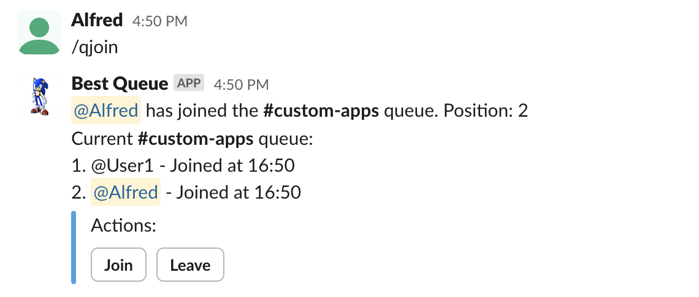
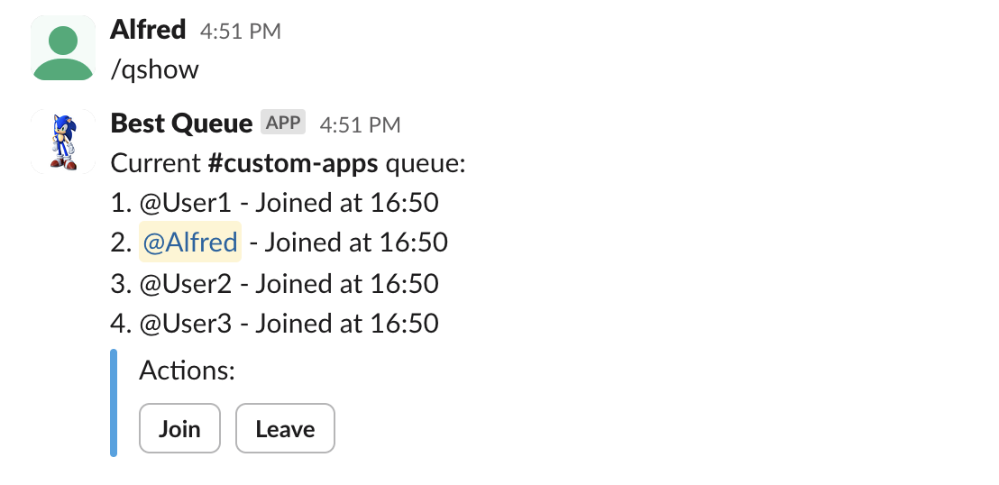
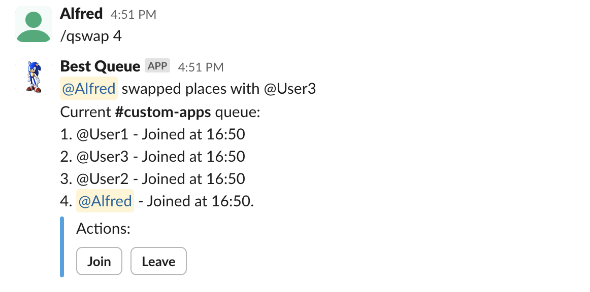
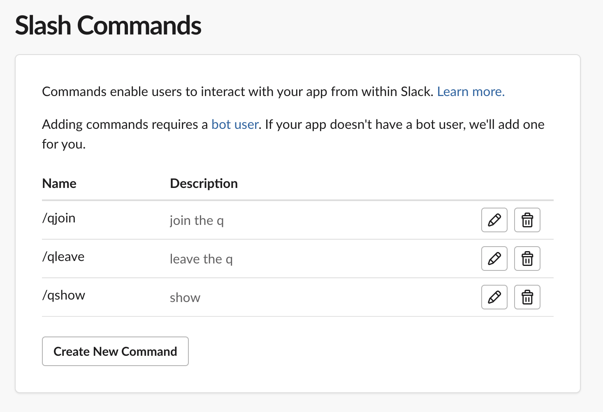
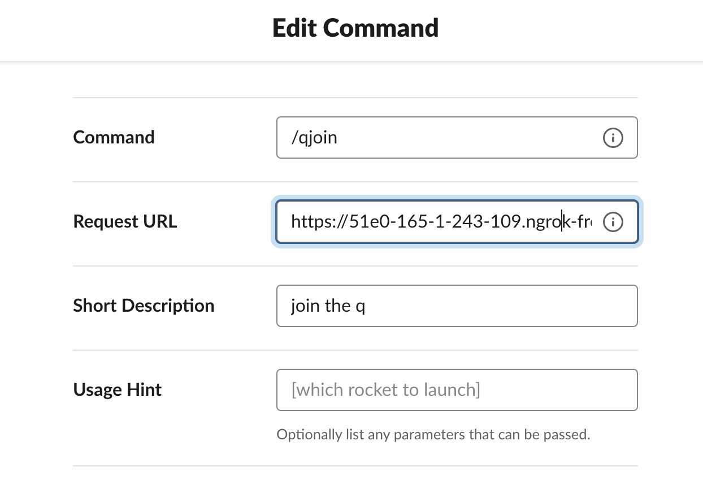

# best-queue
A self-hosted substitute for [Queue](https://ubots.co/queue/)

### Project plans:

1. Application ✅
2. Docker config for an easily deployable image 🔁
3. Automatic deployment to dockerhub/artifactory 🔁

### Example usage:
#### Joining queue

#### Showing queue

#### Swapping places

### Creating the slack app and starting the MVP application

1. Go to the [slack apps page](https://api.slack.com/apps)
2. **Create a new app** -> **From scratch**
3. When asked for **Add features and functionality**, activate **Slash commands** and **Bots**
4. [Install ngrok](https://ngrok.com/download) and [add your authtoken](https://ngrok.com/docs/guides/getting-started/#step-3-connect-your-agent-to-your-ngrok-account)
5. Start your ngrok instance using `ngrok http http://localhost:8080` (swap the port if 8080 is occupied), and save your *forwarding url* shown (should look something like `https://5d71-111-1-243-109.ngrok-free.app`). 
6. In your slack apps page, go to Slash commands, and create one for each of the endpoints `/qjoin`, `/qleave` and `/qshow`. In the *Request URL* field, enter your forwarding url as the endpoint base url. `/qjoin` Example: `https://5d71-111-1-243-109.ngrok-free.app/qjoin`

7. Install your app in your slack workspace of choice. This is done on the home page of your slack app -> *Install your app* -> *Install in workspace*
8. Clone this repository, and start the flask application on port 8080 using `python3 app.py`. If you are missing flask, install it using `pip3 install flask`.
9. Use the commands in any text channel in your slack workspace - the queue app should work! ⭐
