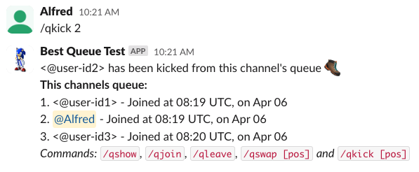

# best-queue
A self-hosted substitute for [Queue](https://ubots.co/queue/).

### Project milestones:

1. Application ✅
2. Docker config for an easily deployable image ✅
3. Automated Github Actions workflows to build, tag and push docker images to dockerhub ✅
4. Support for exporting and importing state ✅

### Example usage:
#### Joining
Most commands support custom queues to be specified as a parameter. Not specifying one defaults to this channel's unique ID. This means you can use multiple queues in the same channel (or one queue across multiple channels!) by specifying `/qjoin emea`, `/qleave emea`, etc.

#### Showing & swapping

#### Kicking

#### Exporting and importing state
Exporting and importing state requires a password to be provided, to avoid misuse or accidental execution. If provided, a JSON-blob corresponding to the application's full memory contents is exported, ready to be imported after an application restart or upgrade.

**Usage:**
- `/qexportstate secret-password`
- `/qimportstate secret-password {"queues":{"#C07BM6F [...full exported json...] }}`

  
   

## Setting up and running the application
### Deploy the back-end application
#### Option 1 - using docker
1. Run `docker-compose up`. The latest image will be pulled and the application starts accepting requests at localhost:8080.

#### Option 2 - run with python
1. Clone this repository, and start the flask application on port 8080 using `python3 app.py`. If you are missing flask, install it using `pip3 install flask`.
2. (Optional, for testing locally) [Install ngrok](https://ngrok.com/download) and [add your authtoken](https://ngrok.com/docs/guides/getting-started/#step-3-connect-your-agent-to-your-ngrok-account). Start your ngrok instance using `ngrok http http://localhost:8080` (swap the port if 8080 is occupied), and save your *forwarding url* (should look something like `https://5d71-111-1-243-109.ngrok-free.app`) for use in the slack app configuration. 

### Create the slack app and set up the required slash commands
1. Go to the [slack apps page](https://api.slack.com/apps)
2. **Create a new app** -> **From scratch**
3. When asked for **Add features and functionality**, activate **Slash commands** and **Bots**
4. In your slack apps page, go to Slash commands, and create one for each of the endpoints `/qjoin`, `/qleave`,`/qshow`, etc. In the *Request URL* field, enter your backend host's url as the base. `/qjoin` Examples: `https://5d71-111-1-243-109.ngrok-free.app/qjoin` or `https://best-queue.my-home-server.com/qjoin`.

  
   

5. Install your app in your slack workspace of choice. This is done on the home page of your slack app -> **Install your app** -> *Install in workspace*

Use the commands in any text channel in your slack workspace - the queue app should work! ⭐
